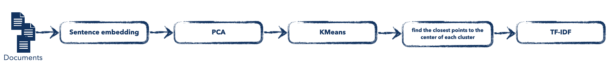

<!-- PROJECT LOGO -->
 

  <a href="https://github.com/kenanGonnot/topic_modeling">

<h3 align="center">Topic Modeling</h3>

  

   By Kenan
     
     
     
  

<!-- TABLE OF CONTENTS -->

  
Table of Contents

  <ol>
    <li>
      <a href="#about-the-project">About The Project</a>
      <ul> </ul>
    </li>
    <li><a href="#contact">Contact</a></li>
  </ol>

<!-- ABOUT THE PROJECT -->
## **_PS: I recommend you to use google collab to run the code._** 

## About The Project

**GOAL :** To create a topic modeling project. 

There are two methods:
* using LDA model (lda_TopicModeling.ipynb)
* using a pipeline like this (pipeline_TopicModeling.ipynb):

***

**DATASETS**: Here I scrapped some text in the web to create a dataset (this data is used for non-commercial purposes):   

| Name              | Qty document | 
|-------------------|--------------|
| French revolution | 9            |
| One piece         | 3            |
| Ancient Egypt     | 4            |
| Machine Learning  | 3            |
| **Python**        | **9**        | 
Python : **This is the topic I used** 

***
<!-- CONTACT -->

## Contact

Student: 
* Kenan Gonnot - [linkedin](https://www.linkedin.com/in/kenan-gonnot/) 

